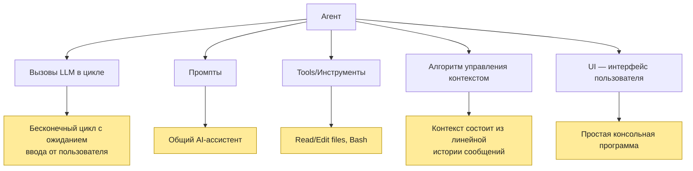
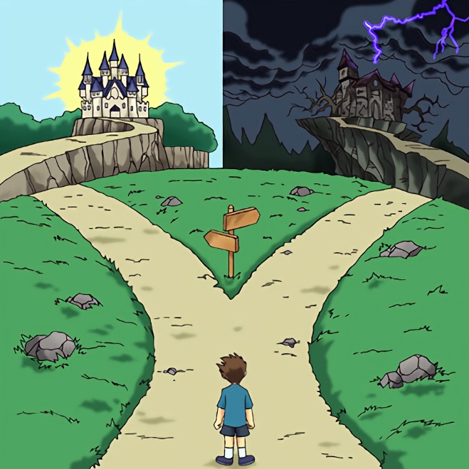

# Что такое агент (agent harness) ?

Агент состоит из нескольких основных компонентов:

# Люди делятся на два типа…

# Тип первый

Вся сложная часть находится в LLM, а модели постоянно улучшаются, и лидеры меняются. Поэтому стоит делать самого агента максимально простым:

- без хитрых промптов;
- без ветвлений контекста;
- с инструментами, максимально приближенными к тем, которые использовались на этапе обучения с подкреплением (RL).

# Тип второй

А давайте добавим:

- `AGENTS.md` (файл, который автоматически будет попадать в контекст);
- RAG-поиск;
- автоматическую индексацию файлов для поиска (`ctags` / `zoekt` / `clangd-indexer`);
- суммаризацию;
- память;
- субагентов;
- критика, ансамбль агентов, частичную оценку траекторий, откат контекста;
- подмешивание промптов во время работы (например, режим планирования);
- давайте все напишем на LangChain/LangGraph это же индустиальный стандарт
- …и ещё миллион идей.

# Критика
- [Evaluating AGENTS.md: Are Repository-Level Context Files Helpful for Coding Agents?
](https://arxiv.org/abs/2602.11988)
- [Retrieval Augmented Search vs Agentic Search: Table 9, Table 10](https://arxiv.org/pdf/2606.19348)
- [Give Your Coding Agent ripgrep, Not grep](https://codeant.ai/blogs/why-coding-agents-should-use-ripgrep)
- [Why I Stopped Using LangGraph](https://dev.to/deadlocker/why-i-stopped-using-langgraph-4jo2)
- [Don’t Build Multi-Agents](https://cognition.com/blog/dont-build-multi-agents)
